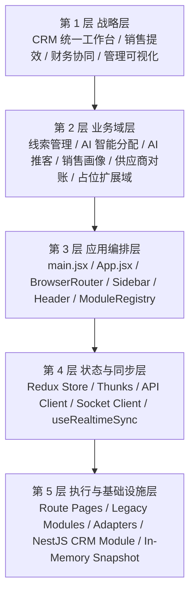
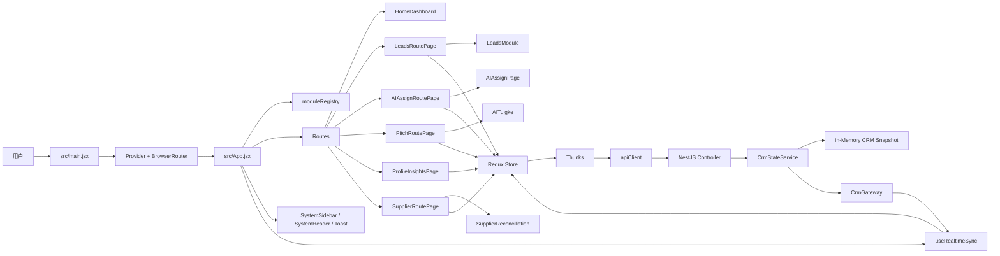
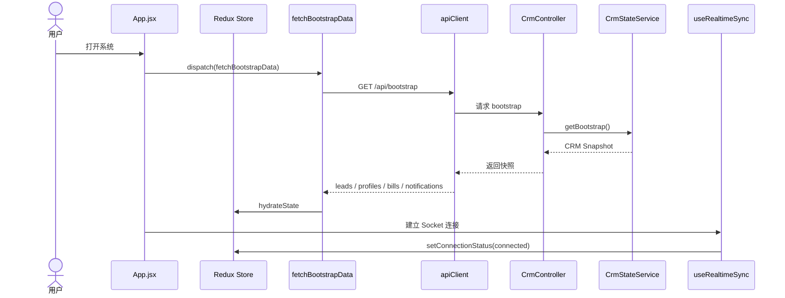
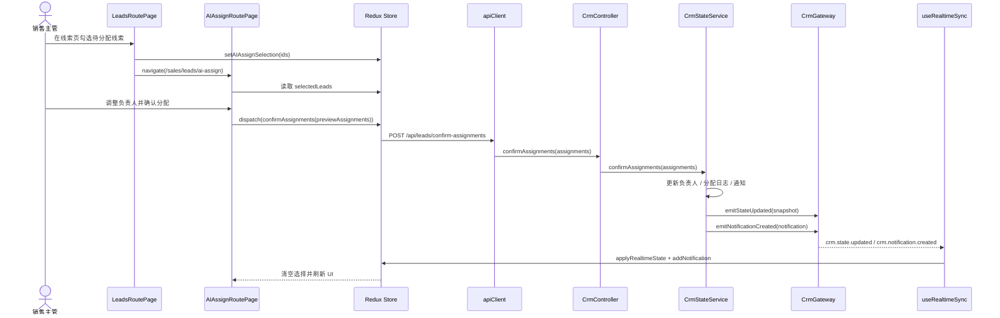
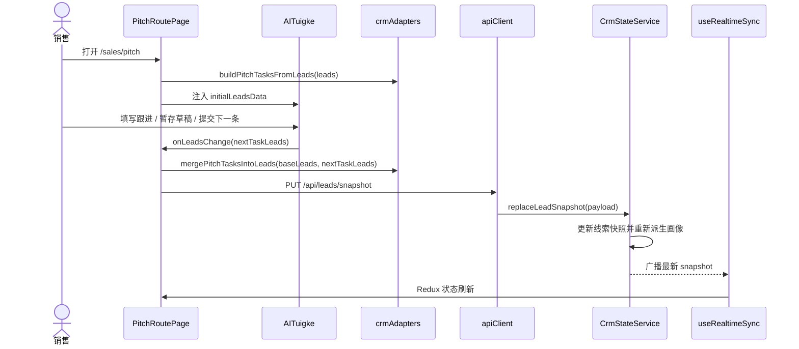
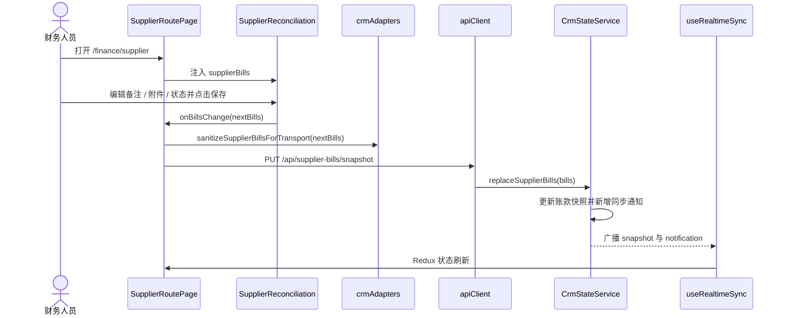

# CRM 当前真实架构说明

## 1. 文档定位

本文档基于当前仓库中已经落地的代码实现整理，目标是把 CRM 项目的战略范围、架构结构、核心流程、时序关系与验证方式讲清楚，便于产品、设计、研发和后续 AI 协作统一理解。

当前版本的本质判断如下：

- 这是一个以 `React + Vite + Tailwind CSS` 为前端基础、以 `React Router + Redux Toolkit` 为编排中枢的统一 CRM 工作台。
- 前端已经不是单纯的本地模块切换原型，而是具备 URL 直达、全局状态、REST 写回和 WebSocket 实时同步能力的可运行演示系统。
- 后端已经补齐 `NestJS + Socket.IO` 的实时闭环骨架，能够承接线索、AI 分配、AI 推客和供应商对账的共享业务状态。
- 旧有大模块没有被整体推翻，而是通过“路由壳 + 适配器 + 外部数据同步回调”的方式接入统一架构。
- 当前系统已经具备真实业务闭环的形态，但后端仍以内存态为主，还不是带数据库、鉴权和审计能力的生产系统。

---

## 2. 项目战略范围框架

### 2.1 战略目标

当前项目围绕一个核心方向展开：把销售侧和财务侧的高频工作收敛到一个统一的 CRM 工作台中，用 AI 辅助线索分配和跟进，用管理视角查看销售画像，用财务视角处理供应商对账，并通过统一状态层与实时后端形成联动作业闭环。

可归纳为四个战略目标：

1. 建立统一工作台入口，降低业务人员在多个系统之间切换的成本。
2. 打通线索从录入、分配、跟进到画像更新的共享数据链路。
3. 提供管理层可消费的实时销售画像与通知机制，辅助调度和干预。
4. 在财务侧补齐供应商账款核对与状态同步能力，纳入同一套前后端业务闭环。

### 2.2 当前范围边界

当前版本已经纳入范围的内容：

- 统一应用壳：侧边栏、头部、角色切换、系统通知、全局 Toast、首页仪表盘。
- 路由编排：`BrowserRouter`、模块注册表、直达路径、通配路由兜底。
- 全局状态：`uiSlice` 与 `crmSlice`，承接共享 UI 状态和业务快照。
- 销售线索域：线索列表、筛选、导入、OCR、清洗、手动分配、AI 分配、分配日志。
- AI 推客域：线索任务池、公司备注、跟进历史、暂存草稿、提交、标记无效、退回线索池。
- 销售画像域：由后端派生的团队画像与负载洞察页。
- 财务域：供应商对账款列表、详情、备注、附件、开票与结算状态同步。
- 实时后端：`NestJS Controller + Service + Gateway`，同时提供 REST 与 Socket 事件通道。

当前仍为占位或未纳入完整生产能力的内容：

- 客户管理、渠道管理、个人中心。
- 大部分财务子模块，如系统服务费、员工对账单、渠道账单、结算订单列表等。
- 登录鉴权、权限中心、数据库持久化、操作审计、任务队列。
- 浏览器级 E2E 自动化测试与接口契约测试。

### 2.3 战略范围五层模型



### 2.4 五层模型清晰描述

| 层级 | 定位 | 当前承载内容 | 关键文件 | 当前特点 |
| --- | --- | --- | --- | --- |
| 第 1 层：战略层 | 定义系统为什么存在 | 统一销售与财务工作台，强调效率、透明度与 AI 辅助 | `README.md`、`Instruction.md` | 目标清晰，方向已从原型展示升级到闭环验证 |
| 第 2 层：业务域层 | 定义系统做哪些事 | 线索管理、AI 分配、AI 推客、销售画像、供应商对账、占位扩展 | `src/pages/*`、`src/modules/*`、`backend/src/crm/seed-data.ts` | 主要核心域已打通，共享数据以线索和账款为主 |
| 第 3 层：应用编排层 | 决定模块如何被装配和直达 | Router、应用壳、头部、导航、模块元数据、子页容器 | `src/main.jsx`、`src/App.jsx`、`src/app/moduleRegistry.js`、`src/components/*` | 已由本地模块切换升级为 URL 路由驱动 |
| 第 4 层：状态与同步层 | 决定前后端如何共享业务状态 | Redux Store、Thunk、REST 调用、Socket 订阅、连接状态、通知 | `src/store/*`、`src/services/*`、`src/app/useRealtimeSync.js` | 共享状态已经集中，Redux 成为前端单一事实来源 |
| 第 5 层：执行与基础设施层 | 承接旧模块、后端服务与数据闭环 | 路由页适配器、旧模块回调同步、NestJS Controller/Service/Gateway、内存快照 | `src/pages/*RoutePage.jsx`、`src/lib/crmAdapters.js`、`backend/src/crm/*` | 通过桥接方式复用现有 UI，同时完成实时闭环 |

这个五层模型说明了当前最核心的架构特征：系统已经从“统一外壳、分散数据的前端原型”升级为“统一应用壳、统一状态层、统一实时后端、旧模块渐进迁移”的过渡架构。

---

## 3. 当前项目真实架构

### 3.1 运行入口链路

项目当前的真实运行入口如下：

1. `src/main.jsx` 负责挂载 React 根节点，并注入 `Provider` 与 `BrowserRouter`。
2. `src/App.jsx` 是应用根组件，负责：
   - 首次触发 `fetchBootstrapData` 拉取后端快照。
   - 调用 `useRealtimeSync` 建立 Socket 订阅。
   - 基于当前 URL 计算模块标题、说明与侧边栏选中状态。
   - 渲染各个路由页或占位页。
3. `src/pages/*RoutePage.jsx` 作为桥接层，把 Redux 共享状态转换成旧模块可消费的 `initial*Data` 和 `on*Change` 协议。
4. `src/store/thunks.js` 通过 `src/services/apiClient.js` 调用 NestJS API。
5. `backend/src/crm/crm-state.service.ts` 更新后端共享快照，并通过 `backend/src/crm/crm.gateway.ts` 广播实时事件。
6. `src/app/useRealtimeSync.js` 监听 `crm.state.updated` 与 `crm.notification.created`，把更新重新折返到 Redux Store。

### 3.2 应用总架构图



### 3.3 目录结构与职责分布

```text
src/
├── main.jsx                         # React 根入口，注入 Router 和 Redux Provider
├── App.jsx                          # 全局应用壳、路由与实时同步入口
├── app/
│   ├── moduleRegistry.js            # 模块元数据与路径映射
│   └── useRealtimeSync.js           # Socket -> Redux 同步
├── store/
│   ├── store.js                     # Redux Store 组装
│   ├── crmSlice.js                  # 共享业务状态
│   ├── uiSlice.js                   # UI 状态、通知、连接状态
│   └── thunks.js                    # REST 写回与异步桥接
├── services/
│   ├── apiClient.js                 # REST 调用封装
│   └── socketClient.js              # Socket.IO 客户端单例
├── lib/
│   └── crmAdapters.js               # 线索/推客/账款适配与序列化逻辑
├── pages/
│   ├── HomeDashboard.jsx            # 首页总览
│   ├── LeadsRoutePage.jsx           # 线索路由壳
│   ├── AIAssignRoutePage.jsx        # AI 分配路由壳
│   ├── PitchRoutePage.jsx           # AI 推客路由壳
│   ├── ProfileInsightsPage.jsx      # 实时画像页
│   └── SupplierRoutePage.jsx        # 财务对账路由壳
├── components/                      # 应用壳与通用组件
├── modules/                         # 旧业务大模块，已通过外部数据同步接入新架构
└── constants/                       # 销售模拟常量与旧逻辑

backend/
├── src/main.ts                      # Nest 启动入口
└── src/crm/
    ├── crm.controller.ts            # REST API
    ├── crm.gateway.ts               # Socket.IO 广播
    ├── crm.state.service.ts         # 共享状态核心服务
    └── seed-data.ts                 # 初始快照与画像派生逻辑
```

### 3.4 全局状态与共享机制

当前前端共享状态已经被拆成两个核心 slice：

- `uiSlice`
  - `userRole`
  - `sidebarOpen`
  - `connectionStatus`
  - `notifications`
  - `toast`
- `crmSlice`
  - `leads`
  - `assignLogs`
  - `aiAssignSelectionIds`
  - `profiles`
  - `supplierBills`
  - `syncedAt`

异步桥接由以下 thunk 承担：

- `fetchBootstrapData`：首次加载业务快照。
- `syncLeadSnapshot`：线索与推客结果回写后端。
- `confirmAssignments`：AI 分配确认并回写负责人、日志、通知。
- `syncSupplierBills`：供应商账款详情回写后端。
- `markNotificationsRead`：通知统一已读。

模块之间当前共享方式主要有四种：

1. Redux 作为前端共享业务单一事实来源。
2. 路由壳把共享状态转换为旧模块接受的 `initial*Data`。
3. 旧模块通过 `on*Change` 回调把内部状态变化折返到 Redux。
4. NestJS 在服务侧统一生成快照、通知和画像，再通过 Socket 回推前端。

### 3.5 架构关键特征

当前项目的架构特征可以概括为以下五点：

1. 已经具备真实路由系统，模块与子页均可通过 URL 直达。
2. 已经具备统一状态层，Redux 成为共享业务状态源。
3. 已经具备后端共享业务核心，NestJS 负责快照、通知与实时广播。
4. 旧有大模块通过适配器与回调接入新架构，而不是一次性重写。
5. 首页、画像页、通知区都能消费同一份后端业务快照，形成跨模块联动。

---

## 4. 业务模块拆解

### 4.1 线索管理路由 `LeadsRoutePage`

这是当前销售域的主入口，职责是：

- 从 Redux 读取 `leads` 与 `assignLogs`。
- 把数据注入 `LeadsModule`。
- 监听 `LeadsModule` 的 `onLeadsChange` 与 `onAssignLogsChange`。
- 调用 `setLeadWorkspace + syncLeadSnapshot`，把变更写入前端共享状态与后端快照。
- 当用户点击 `AI智能分配` 时，把选中线索 ID 写入 `aiAssignSelectionIds`，并跳转到 `/sales/leads/ai-assign`。

### 4.2 AI 智能分配路由 `AIAssignRoutePage`

该路由负责把线索选择、预分配结果和后端回写闭合起来：

- 从 Redux 中读取 `aiAssignSelectionIds`。
- 基于当前 `leads` 过滤出 `selectedLeads`。
- 将 `selectedLeads` 传给 `AIAssignPage` 生成和编辑预分配结果。
- 用户点击确认后，触发 `confirmAssignments` thunk。
- 后端更新负责人、分配日志、通知，并通过 Socket 回推全局状态。
- 成功后清空 `aiAssignSelectionIds`，确保分配页面与线索页的状态一致。

### 4.3 AI 推客路由 `PitchRoutePage`

该路由负责把线索主池与 AI 推客任务池之间的双向映射稳定下来：

- 使用 `buildPitchTasksFromLeads(leads)`，把共享线索转为 `AITuigke` 可消费的任务格式。
- `AITuigke` 内部继续保留其节奏化、本地状态驱动的交互体验。
- 当 `AITuigke` 回传 `nextTaskLeads` 时，通过 `mergePitchTasksIntoLeads` 合并回 canonical leads。
- 之后调用 `setLeadWorkspace + syncLeadSnapshot` 回写后端，带动首页、画像页和通知区刷新。

### 4.4 销售画像页 `ProfileInsightsPage`

当前画像页不再走旧版 `ProfileModule` 的大块本地模拟数据，而是直接展示后端根据线索快照派生出的团队画像：

- 每位成员的名下线索数。
- 已完成任务数。
- 高价值线索数。
- 平均评分。
- 当前工作负载状态（高负载 / 稳定推进 / 可接新线索）。

因此它已经成为销售线索与 AI 推客结果的下游消费页，而不是独立的静态展示页。

### 4.5 财务路由 `SupplierRoutePage`

该路由负责把供应商对账模块接到共享状态与后端写回能力上：

- 从 Redux 读取 `supplierBills`。
- 将账单数据传给 `SupplierReconciliation`。
- 当账单详情发生变化时，先通过 `sanitizeSupplierBillsForTransport` 清理 `File` 等不可序列化对象。
- 再调用 `setSupplierBillsLocal + syncSupplierBills`，把账单详情同步到前端共享状态和后端快照。

### 4.6 占位模块

以下模块已经纳入导航和路径注册，但当前仍为占位状态：

- 客户管理
- 渠道管理
- 个人中心
- 系统服务费
- 员工对账单
- 员工账单校正
- 渠道对账单
- 渠道账单校正
- 客户账单校正
- 结算订单列表

---

## 5. 核心流程

### 5.1 全局路由切换流程

```mermaid
flowchart LR
    A[用户点击侧边栏菜单] --> B[navigate(path)]
    B --> C[BrowserRouter 更新 location]
    C --> D[App 重新计算 currentModule]
    D --> E[SystemHeader 更新标题与说明]
    D --> F[Routes 渲染对应 Route Page]
    F --> G[Route Page 注入共享状态与回调]
    G --> H[Legacy Module 渲染真实业务界面]
```

这个流程说明：当前系统已经由 URL 驱动，而不是本地 `activeModule` 驱动。

### 5.2 AI 智能分配闭环流程

```mermaid
flowchart LR
    A[线索页勾选线索] --> B[setAIAssignSelection]
    B --> C[跳转 /sales/leads/ai-assign]
    C --> D[AIAssignPage 生成预分配方案]
    D --> E[确认分配]
    E --> F[confirmAssignments thunk]
    F --> G[POST /api/leads/confirm-assignments]
    G --> H[CrmStateService 更新负责人/日志/通知]
    H --> I[CrmGateway 推送 crm.state.updated]
    I --> J[useRealtimeSync 回写 Redux]
    J --> K[线索页 / 首页 / 画像页同步刷新]
```



### 5.3 AI 推客闭环流程

```mermaid
flowchart LR
    A[PitchRoutePage 读取 canonical leads] --> B[buildPitchTasksFromLeads]
    B --> C[AITuigke 渲染任务池]
    C --> D[销售填写跟进 / 暂存 / 无效 / 退回]
    D --> E[onLeadsChange(nextTaskLeads)]
    E --> F[mergePitchTasksIntoLeads]
    F --> G[syncLeadSnapshot]
    G --> H[PUT /api/leads/snapshot]
    H --> I[CrmStateService 更新 leads/profiles/notifications]
    I --> J[Socket 回推]
    J --> K[首页与画像页同步刷新]
```

### 5.4 供应商对账闭环流程

```mermaid
flowchart LR
    A[财务进入供应商对账页] --> B[选择账单并编辑详情]
    B --> C[SupplierReconciliation 产生 nextBills]
    C --> D[sanitizeSupplierBillsForTransport]
    D --> E[syncSupplierBills]
    E --> F[PUT /api/supplier-bills/snapshot]
    F --> G[CrmStateService 更新 supplierBills]
    G --> H[新增同步通知]
    H --> I[Socket 回推状态与通知]
    I --> J[首页未读通知与账款数量刷新]
```



### 5.5 画像派生流程

1. 后端维护当前共享线索主池。
2. `deriveProfilesFromLeads` 根据负责人、评分、跟进状态和行业生成团队画像。
3. 每次线索快照或 AI 分配发生变化，画像都会在后端重新派生。
4. 前端画像页只消费后端派生结果，不自行拼装模拟数据。

---

## 6. 时序图

### 6.1 首次加载与实时订阅时序



### 6.2 AI 智能分配确认时序



### 6.3 AI 推客写回时序



### 6.4 供应商对账写回时序



---

## 7. 验证方式与回归脚本

### 7.1 当前可执行验证

当前仓库已经具备三类可执行验证手段：

1. `npm run test:business`
   - 执行 `src/lib/crmAdapters.test.js`
   - 执行 `backend/src/crm/crm-state.service.test.ts`
2. `npm run build`
   - 验证前端路由、Redux 接线与页面编译
3. `npm run build:api`
   - 验证 NestJS 后端编译

### 7.2 已覆盖的自动化回归点

自动化测试当前覆盖的核心点如下：

- AI 推客前置适配：已验证 `buildPitchTasksFromLeads` 的过滤与归一化。
- AI 推客回写合并：已验证 `mergePitchTasksIntoLeads` 会把任务结果折返到 canonical leads。
- 供应商附件传输：已验证 `sanitizeSupplierBillsForTransport` 会移除不可序列化的 `File` 对象。
- AI 分配服务写回：已验证 `confirmAssignments` 会更新负责人、分配日志并生成通知。
- 推客快照写回：已验证 `replaceLeadSnapshot` 会触发画像重新派生和同步通知。
- 财务对账写回：已验证 `replaceSupplierBills` 与 `markNotificationsRead` 的服务侧行为。

### 7.3 手工回归脚本位置

完整的业务手工回归脚本已经整理在根目录 `QA_REGRESSION.md`，用于覆盖：

- AI 分配端到端闭环
- AI 推客端到端闭环
- 供应商对账端到端闭环

---

## 8. 架构现状结论

### 8.1 当前优势

1. 统一应用壳、统一路由、统一状态和统一后端快照已经形成基本稳定的主干架构。
2. 线索、AI 分配、AI 推客、画像和供应商对账已经具备共享状态和实时联动能力。
3. 旧模块通过桥接方式复用，避免了一次性重写的高风险。
4. 首页、通知区和画像页都能消费同一份业务快照，说明核心数据流已经打通。
5. 代码层已经具备自动化回归入口，而不再完全依赖手工点测。

### 8.2 当前限制

1. 后端仍以内存态为主，服务重启后业务快照会重置。
2. 尚未接入数据库、登录鉴权、权限中心和审计日志。
3. 大量旧模块仍是“大组件 + 本地状态”结构，只是已经被桥接进新架构。
4. 多个财务与管理模块仍是占位页，还未进入真实闭环。
5. 当前自动化测试主要覆盖逻辑层与服务层，尚未覆盖浏览器级 E2E。

### 8.3 下一阶段优先级

1. 引入数据库与持久化，让后端快照从内存态升级为可恢复业务数据。
2. 补齐鉴权、角色权限和接口边界校验。
3. 为关键业务路径补充浏览器级 E2E 与接口契约测试。
4. 继续拆分旧模块，把路由壳过渡为真正的组件化页面。
5. 逐步迁移剩余财务子模块和客户/渠道域的共享数据源。

---

## 9. 一句话总结

这个项目当前的最佳定义是：

> 一个以 `React Router + Redux Toolkit` 为前端编排中枢、以 `NestJS + Socket.IO` 为实时后端骨架、以旧模块渐进迁移为落地策略、已经具备销售与财务核心链路闭环能力的 CRM 演示系统。